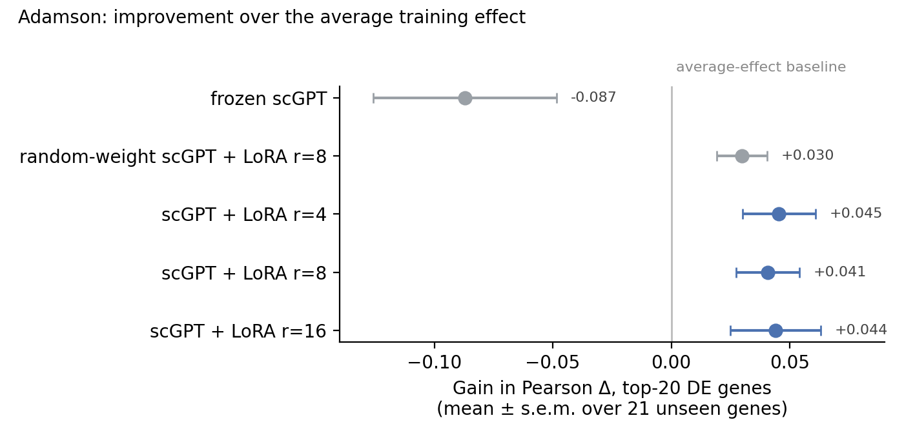

# perturb-lora-bench

Can a single-cell foundation model, lightly fine-tuned, predict how cells respond
to a genetic perturbation it has never seen? This repo fine-tunes scGPT [1] with
LoRA [2] on Perturb-seq data and compares it against simple baselines.

Adamson results are in (below); Norman, with gene pairs, is next.

## The problem

In a Perturb-seq experiment, each cell gets a CRISPR guide that switches one
gene off (CRISPRi) or on (CRISPRa), and is then profiled with single-cell
RNA-seq. The task here: given the expression of control cells and the name of
the targeted gene, predict the average expression profile of perturbed cells.
The test set contains only perturbations the model never saw during training.

Most genes barely change after any single perturbation. So a model that
predicts "nothing changes" already matches the true profile closely on raw
expression, and a model can look good on that metric while learning nothing
about the perturbation. Ahlmann-Eltze et al. [3] showed that published deep
learning models, including scGPT, often do no better than simple additive or
mean baselines on this task. Any claim of improvement needs those baselines
next to it, and a metric that looks at what changed.

scPEFT [7] applied LoRA and other adapters to scGPT on the same datasets and
reported results comparable to full fine-tuning and GEARS, but did not compare
against these simple baselines. That leaves an open question, which this repo
tests:

> LoRA leaves the pretrained weights intact. If scGPT's pretraining carries
> information that helps predict unseen perturbations, LoRA fine-tuning should
> beat the additive baseline on the top-20 DE genes, and should beat the same
> setup on a randomly initialised scGPT. If it does neither, pretraining is not
> contributing to this task.

## Data

| Dataset | Cells | Perturbations | Used for |
|---|---|---|---|
| Adamson et al. 2016 [4] | K562, CRISPRi | single genes | debugging the pipeline |
| Norman et al. 2019 [5] | K562, CRISPRa | single genes and pairs | main results |

GEARS [6] is a graph neural network that predicts perturbation effects using a
gene–gene graph built from Gene Ontology. I use only its preprocessed data and
its "simulation" split, not the model, so the numbers can be compared with
GEARS and scGPT.

Adamson after GEARS preprocessing: 5,060 genes and 81 perturbations, split
54 train / 6 validation / 21 test (split seed 1). All 21 test perturbations are
single genes never seen in training. GEARS drops 5 perturbations whose gene is
not in its Gene Ontology graph (SRPR, SLMO2, TIMM23, AMIGO3, KCTD16).

## Model

scGPT [1] is a transformer pretrained on over 33 million human cells, and I
load it through Helical's `helical` package. Each cell is read as a set of gene
tokens with expression values.

LoRA [2] freezes the pretrained weights and trains a small low-rank update
next to selected weight matrices, so only about 1% of the parameters change.
For a frozen matrix W it learns two thin matrices A and B and computes
`W x + (alpha / r) * B A x`, with rank r = 8 and alpha = 16 here. B starts at
zero, so training begins from exactly the pretrained model.

On top of the frozen encoder with LoRA sit two new pieces trained from scratch:
an embedding added to the perturbed gene's token, and a small MLP that predicts
each gene's change from control. The MLP's output layer starts at zero, so an
untrained model predicts "no change".

Training details:

- Input: one control cell, 512 genes per pass (the perturbed genes plus a
  random subset of the rest). At test time the genes are covered in chunks.
  512 rather than scGPT's usual ~1,200 because training runs on CPU.
- Target: the observed mean change for that perturbation (perturbed-cell mean
  minus control mean), with MSE loss. Predicting a mean rather than a single
  cell removes cell-to-cell noise from the target.
- Prediction for a test perturbation: the control mean plus the predicted
  change averaged over 16 control cells.
- Gene symbols are matched to scGPT's vocabulary exactly first, then through
  HGNC's record of renamed genes (a pinned 2026-02-06 snapshot), using the
  dataset's Ensembl IDs where available. By exact symbol alone, 4,399 of 5,060
  Adamson genes (87%) matched. Genes that still don't match are predicted as
  unchanged; the training log reports the counts.
- Trainable parameters at r = 8: 559,105 (294,912 LoRA, 264,193 in the
  perturbation embedding and MLP).

### Where the adapters go

The brief I started from said to put LoRA on the query and value projections
(`q_proj`, `v_proj`), the usual choice for language models. scGPT doesn't
have those layers. It uses PyTorch's `nn.MultiheadAttention`, which stores the
query, key and value weights in one stacked 1536 × 512 matrix. PEFT therefore
adapts the attention block as a whole: the stacked matrix plus the output
projection. At r = 8 that comes to 294,912 trainable parameters across the 12
layers.

### A bug that would have invalidated the results

In eval mode, PyTorch runs `TransformerEncoderLayer` through a fused fast path
that reads the attention weights directly and never calls the LoRA wrapper.
The fine-tuned model then produces exactly the base model's output, with no
error or warning. I found this by setting the LoRA weights to random values
and checking that eval output changed; it didn't. The fix is
`torch.backends.mha.set_fastpath_enabled(False)`, and
`tests/test_lora.py::test_lora_active_in_eval_mode` keeps it from coming back.
This applies to scGPT built on PyTorch's stock attention, as in helical 2.2.0;
helical 3.x uses its own attention module without the fast path.

## Evaluation

Every metric is computed per test perturbation on the mean expression profile,
then averaged over perturbations.

The main metric is Pearson correlation of the delta: predicted change from
control against true change from control, over all genes and over the 20 most
differentially expressed genes. I also report MSE on the same two gene sets.
Raw-expression correlation is included only to show how misleading it is.

Models compared (one config per row in `configs/`):

| Name | What it is |
|---|---|
| `no_change` | the control profile |
| `train_mean` | control plus the average effect of all training perturbations |
| `additive` | control plus the single-gene effects seen in training (average effect for unseen genes) |
| `frozen` | pretrained scGPT, frozen; only the perturbation embedding and MLP train |
| `lora_r4`, `lora_r8`, `lora_r16` | pretrained scGPT with LoRA (alpha = 2r) |
| `random_lora_r8` | same as `lora_r8`, but scGPT's weights are randomly initialised |

The last row is the key control: if it matches `lora_r8`, pretraining adds
nothing. The rank sweep shows whether gains come from the pretrained weights
or just from more trainable parameters.

Hyperparameters and early stopping use the validation split. The test split is
scored once, at the end.

## Results

### Adamson (21 unseen test genes, mean ± s.e.m.)

| Model | Pearson Δ top-20 DE | Pearson Δ all | MSE top-20 DE | MSE all |
|---|---|---|---|---|
| `lora_r4` | 0.666 ± 0.134 | 0.610 ± 0.100 | 0.230 ± 0.072 | 0.007 ± 0.002 |
| `lora_r16` | 0.665 ± 0.137 | 0.594 ± 0.102 | 0.236 ± 0.075 | 0.007 ± 0.002 |
| `lora_r8` | 0.662 ± 0.135 | 0.608 ± 0.099 | 0.234 ± 0.075 | 0.007 ± 0.002 |
| `random_lora_r8` | 0.651 ± 0.134 | 0.622 ± 0.099 | 0.256 ± 0.082 | 0.008 ± 0.002 |
| `train_mean` | 0.621 ± 0.135 | 0.636 ± 0.103 | 0.252 ± 0.069 | 0.006 ± 0.002 |
| `frozen` | 0.534 ± 0.117 | 0.404 ± 0.067 | 0.314 ± 0.067 | 0.008 ± 0.001 |
| `no_change` | n/a | n/a | 0.399 ± 0.055 | 0.010 ± 0.001 |

`additive` equals `train_mean` on Adamson (every test gene is unseen), so it is
left out. Pearson Δ is undefined for `no_change` because its predicted change is
zero. Predicting no change still gets a raw-expression Pearson r of 0.984, which
is why raw correlation isn't used to rank models.



The standard errors in the table are large because the test genes vary a lot,
so the useful comparison is paired, gene by gene, against `train_mean`:

| Model | Gain in Pearson Δ top-20 DE (paired s.e.m.) | Genes improved |
|---|---|---|
| `lora_r4` | +0.045 (0.015) | 15 / 21 |
| `lora_r8` | +0.041 (0.013) | 16 / 21 |
| `lora_r16` | +0.044 (0.019) | 13 / 21 |
| `random_lora_r8` | +0.030 (0.011) | 14 / 21 |
| `frozen` | −0.087 (0.039) | 6 / 21 |

What this says:

1. LoRA-tuned scGPT beats the average-effect baseline, but only slightly:
   about +0.04 in Pearson Δ on the top-20 DE genes, with lower top-20 MSE
   (0.234 vs 0.252). Over all genes it is slightly worse (0.61 vs 0.64).
2. Most of that gain doesn't need pretraining. The same model with random
   weights gets +0.030. Pretrained minus random is +0.011 (paired s.e.m.
   0.006, better on 12 of 21 genes), which 21 genes cannot distinguish from
   zero.
3. The LoRA rank doesn't matter: r = 4, 8 and 16 are indistinguishable.
4. Frozen scGPT with a trained head does worse than the baseline. The
   pretrained representation on its own is not enough; the attention layers
   have to adapt.
5. No model gets CREB1, DDIT3 or BHLHE40 right. All three are transcription
   factors whose knockdown moves their DE genes opposite to the average
   training effect, and every model, pretrained or not, scores between −0.60
   and −0.85 on them. Predicting these needs knowledge of what the specific
   gene does, and scGPT's pretraining on unperturbed cells doesn't supply it
   here.

Put simply: on Adamson, fine-tuning scGPT with LoRA mostly learns a refined
version of the average response, and pretraining adds little that a randomly
initialised network trained the same way doesn't also learn.

## Reproducing

```bash
conda env create -f environment.yml -p /path/to/envs/plb
conda activate /path/to/envs/plb
make test    # unit tests, no data or GPU needed
make all     # download data, run baselines, train, evaluate, plot
```

On a SLURM cluster, one job per config (use slurm/gpu.sbatch if a GPU is available):

```bash
for c in configs/adamson_*.yaml; do sbatch slurm/cpu.sbatch python scripts/train.py --config $c; done
```

On 16 CPU cores one training step takes about 4 s, so a full Adamson run
(20 epochs × 100 steps, plus testing) takes about 2.5 hours.

`requirements.lock` pins every package for Linux, Python 3.11, and torch 2.7.0
with CUDA 12.6. Seeds and settings live in `configs/`, and training runs are
logged to Weights & Biases.

## What I don't trust

- 21 test genes from one split seed. The pretrained-vs-random gap (+0.011)
  would need more genes or more split seeds to resolve either way.
- Validation has only 6 genes and scores much higher than test (about 0.93 vs
  0.66), probably because it holds none of the "opposite direction" genes.
  Early stopping on it is noisy.
- The scGPT runs use 512 genes per pass and 16 control cells for prediction
  because they ran on CPU. All models share these settings, but longer inputs
  on a GPU could change the numbers.
- One training seed per configuration.
- The environment pins helical 2.2.0. Helical 3.x replaces PyTorch's attention
  in scGPT with its own module (helical PR #405), which removes the fast-path
  bug above but also changes where LoRA can attach, so these configs would
  need changes to run on 3.x.
- Gene matching: exact symbols matched 4,399 of 5,060 genes; HGNC renames
  recovered 520 more (4,919, 97%), including the three test genes HARS, TARS
  and CARS that were otherwise invisible to the model.

## References

1. Cui H, Wang C, Maan H, et al. scGPT: toward building a foundation model for
   single-cell multi-omics using generative AI. *Nature Methods* 21, 1470–1480 (2024).
2. Hu EJ, Shen Y, Wallis P, et al. LoRA: Low-rank adaptation of large language
   models. *ICLR* (2022).
3. Ahlmann-Eltze C, Huber W, Anders S. Deep-learning-based gene perturbation
   effect prediction does not yet outperform simple linear baselines.
   *Nature Methods* (2025). doi:10.1038/s41592-025-02772-6
4. Adamson B, Norman TM, Jost M, et al. A multiplexed single-cell CRISPR
   screening platform enables systematic dissection of the unfolded protein
   response. *Cell* 167, 1867–1882 (2016).
5. Norman TM, Horlbeck MA, Replogle JM, et al. Exploring genetic interaction
   manifolds constructed from rich single-cell phenotypes. *Science* 365,
   786–793 (2019).
6. Roohani Y, Huang K, Leskovec J. Predicting transcriptional outcomes of novel
   multigene perturbations with GEARS. *Nature Biotechnology* 42, 927–935 (2024).
7. Harnessing the power of single-cell large language models with parameter
   efficient fine-tuning using scPEFT. *bioRxiv* (2025).
   doi:10.1101/2025.04.21.649754
8. Istrate A-M, Li D, Karaletsos T. scGenePT: Is language all you need for
   modeling single-cell perturbations? *bioRxiv* (2024).
   doi:10.1101/2024.10.23.619972

## License

MIT
